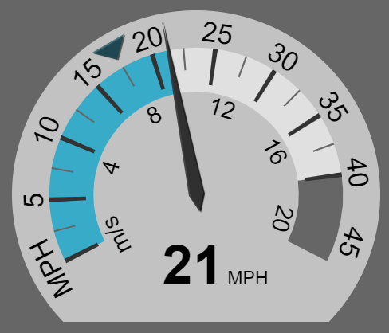

vehicle_gauges.js
========

Native, animated JavaScript gauges for vehicle speed.



 * Speedometer gauge with cruise set point (target speed indicator)
 * No images, no external CSS - pure canvas
 * No dependencies
 * Highly configurable
 * Resolution independent
 * Animated gauge value changes
 * Works in all major browsers
 * MIT License

## Example Usage

```html
<canvas id="foo" width="250" height="210"></canvas>
```

```javascript
var gauge_opts = {
    minValue: 0,
    maxValue: 21,
    defaultInputUnits: 'm/s', //input units when none is specified {'m/s','MPH','KPH'}
    primaryDisplayUnits: 'MPH', //units for labels around outside
    secondaryDisplayUnits: 'm/s', //units for labels around inside
    target_options: {
        distFromCenter: 0.85,
        sizeScale: 1,
        color: '#00445599'    
    },
    originY: 240, //vertical rotation center (default is middle of canvas)
    scale: 1.1 //percent of canvas height
};
var target = document.getElementById('foo'); //your canvas element
var gauge = new Gauge(target).setOptions(gauge_opts); //create gauge

gauge.setSpeed(9.5); // uses default input units
gauge.setTargetSpeed(28,'KPH');
gauge.setLimitSpeed(40,'MPH')
gauge.setInfo('Low Fuel');
```
