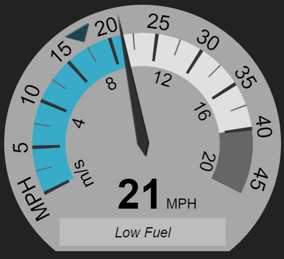

gauge.js
========

100% native, animated JavaScript vehicle gauges.



 * No images, no external CSS - pure canvas
 * No dependencies
 * Highly configurable
 * Resolution independent
 * Animated gauge value changes
 * Works in all major browsers
 * MIT License

## Example Usage

```javascript
var gauge_opts = {
    minValue: 0,
    maxValue: 13.5,
    defaultInputUnits: 'm/s', //input units when none is specified {'m/s','MPH','KPH'}
    primaryDisplayUnits: 'MPH', //units for labels around outside
    secondaryDisplayUnits: 'm/s', //units for labels around inside
    target_options: {
        distFromCenter: 0.63,
        sizeScale: 1,
        color: '#00445599'    
    }
};
var target = document.getElementById('foo'); // your canvas element
var gauge = new Gauge(target).setOptions(gauge_opts); // create gauge
gauge.set(8); // set actual value
```
